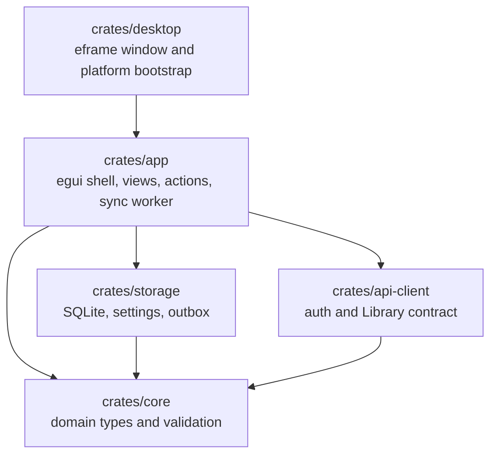
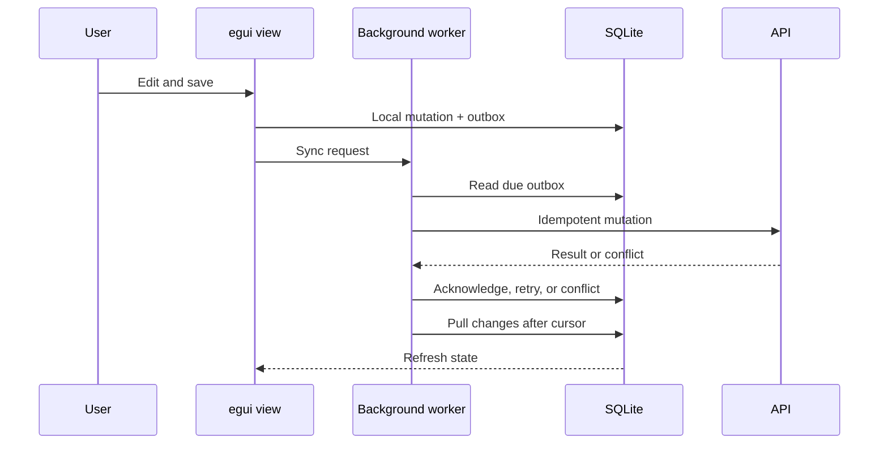

# Architecture

```mermaid
flowchart TB
    Desktop[crates/desktop<br/>eframe window and platform bootstrap]
    App[crates/app<br/>egui shell, views, actions, sync worker]
    Core[crates/core<br/>domain types and validation]
    Storage[crates/storage<br/>SQLite, settings, outbox]
    API[crates/api-client<br/>auth and Library contract]

    Desktop --> App
    App --> Core
    App --> Storage
    App --> API
    Storage --> Core
    API --> Core
```

## Runtime

```mermaid
sequenceDiagram
    participant User
    participant View as egui view
    participant Worker as Background worker
    participant SQLite
    participant API
    User->>View: Edit and save
    View->>SQLite: Local mutation + outbox
    View->>Worker: Sync request
    Worker->>SQLite: Read due outbox
    Worker->>API: Idempotent mutation
    API-->>Worker: Result or conflict
    Worker->>SQLite: Acknowledge, retry, or conflict
    Worker->>SQLite: Pull changes after cursor
    SQLite-->>View: Refresh state
```

Only `crates/app` and `crates/desktop` know about egui/eframe. Domain,
persistence, and HTTP code remain framework-independent.
