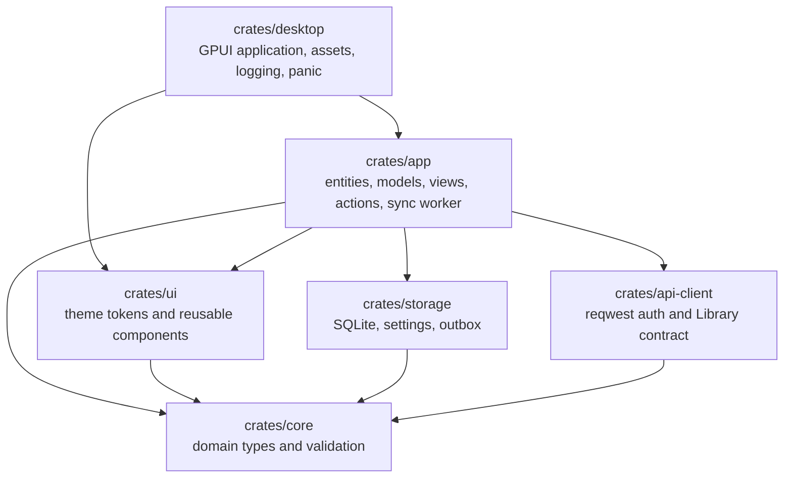
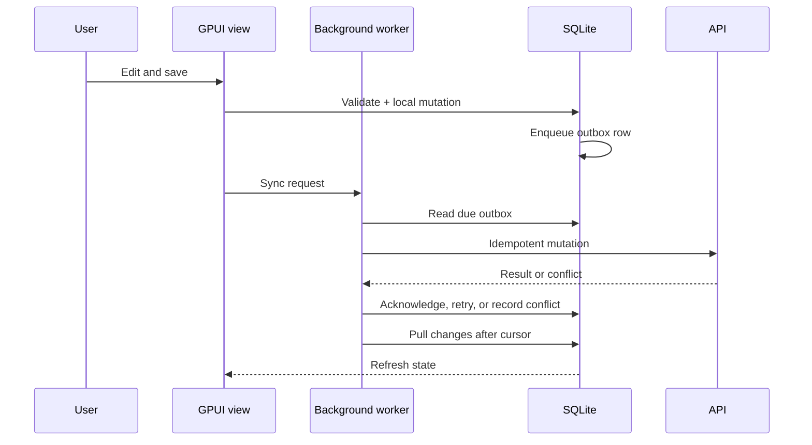

# Architecture

```mermaid
flowchart TB
    Desktop[crates/desktop<br/>GPUI application, assets, logging, panic]
    App[crates/app<br/>entities, models, views, actions, sync worker]
    UI[crates/ui<br/>theme tokens and reusable components]
    Core[crates/core<br/>domain types and validation]
    Storage[crates/storage<br/>SQLite, settings, outbox]
    API[crates/api-client<br/>reqwest auth and Library contract]

    Desktop --> App
    Desktop --> UI
    App --> UI
    App --> Core
    App --> Storage
    App --> API
    UI --> Core
    Storage --> Core
    API --> Core
```

Dependencies point down. GPUI may appear only in `ui`, `app`, and `desktop`.

## Runtime

```mermaid
sequenceDiagram
    participant User
    participant View as GPUI view
    participant Worker as Background worker
    participant Store as SQLite
    participant API

    User->>View: Edit and save
    View->>Store: Validate + local mutation
    Store->>Store: Enqueue outbox row
    View->>Worker: Sync request
    Worker->>Store: Read due outbox
    Worker->>API: Idempotent mutation
    API-->>Worker: Result or conflict
    Worker->>Store: Acknowledge, retry, or record conflict
    Worker->>Store: Pull changes after cursor
    Store-->>View: Refresh state
```
